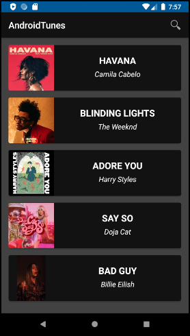

# AndroidTunes

Android app that allows users to search and discover various songs and key details related to the song including album images. 

The app does the following :

1. The app opens up and displays the top picks panel and the different genres of music 

2. Upon clicking on one of the genres, it brings the user to a list of songs belonging to the particular genre

3. Clicking on a particular song in the list would bring up the details of the song (Title,Artist etc.)

Key Features:

1. Top Picks Panel - displays popular songs
2. Slider Images - allows users to swipe through 3 images related to the song 
